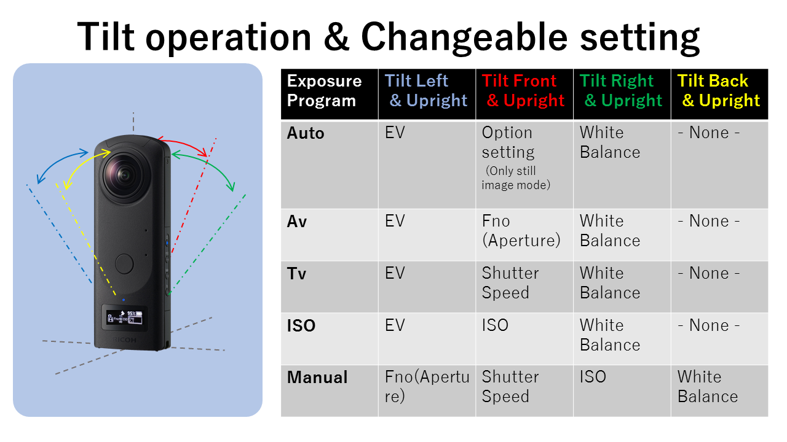
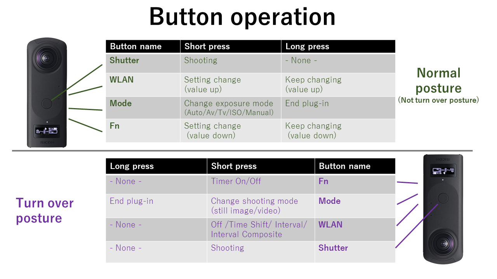
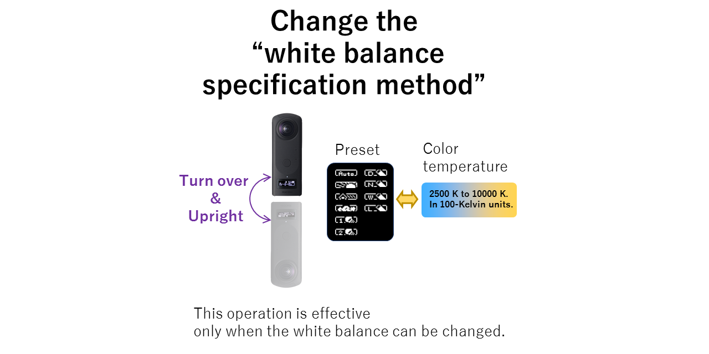
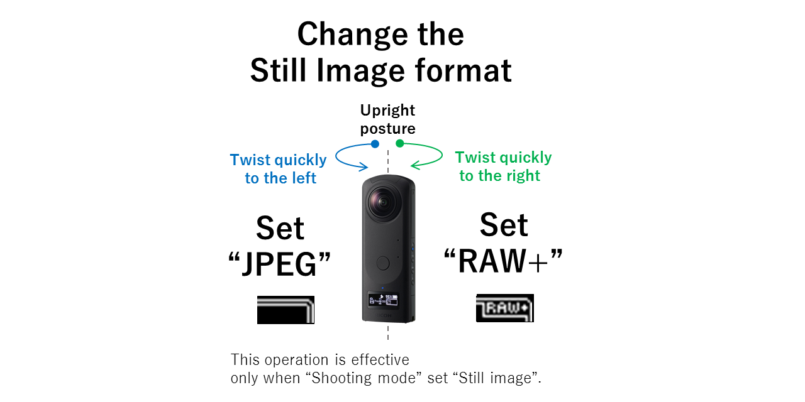
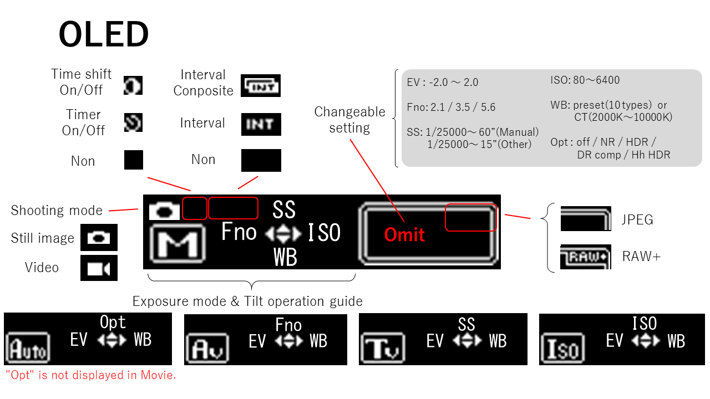
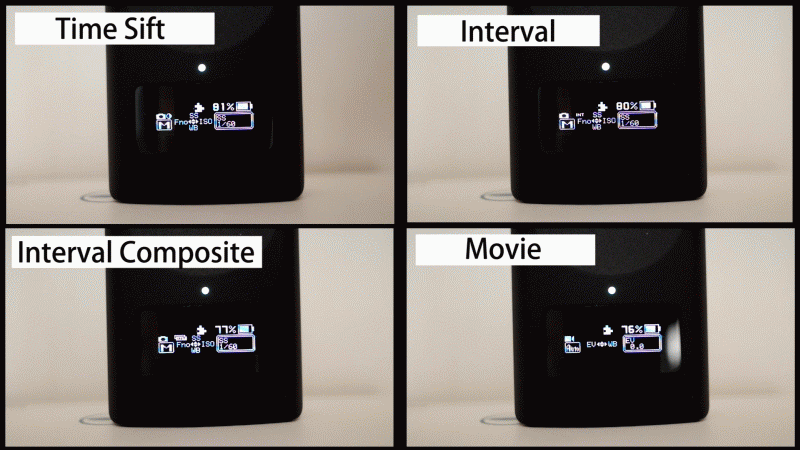

# Change via Tilt

English page [here](README.md)

## 概要

このTHETAプラグインを使うと、THETAの姿勢とボタン操作を組み合わせ、撮影設定を変更できます。
殆どの撮影設定をスマートフォンなしで行えます。

本プラグインで操作できる事項は以下の通り。

- 撮影モード(image/video)の切り替え
- 露出モード(Auto/Av/Tv/Iso/Manual)の切り替え
- 各露出モードにおける撮影設定<br>(絞り、シャッター速度、ISO感度、ホワイトバランス、静止画autoモードにおけるOption setting[NR/DR Comp/HDR/Hh HDR] )
- ホワイトバランス の指定方法（プリセット/色温度）の切り替え
- 静止画撮影時におけるファイル保存形式(JPEG/RAW+)の切り替え
- セルフタイマーのOn/Off切り替え
- 連続撮影（Off/Time Shift/Interval/Interval Composite）の切り替え

このプラグインで行った設定はプラグイン終了時に保存され、再びプラグインを起動したときに復帰します。

本プラグインはリモートコントローラー（ "Vol+"のキーコードを送出するHIDデバイス）に対応しています。

以下動画も参照してください。

[](http://www.youtube.com/watch?v=wF3f3BWbe4M "")


## 傾け操作による変更可能項目の選択方法




## ボタン操作




## ホワイトバランス指定方法の変更




## 静止画ファイル形式の変更




## OLEDの表示



- タイムシフト撮影中とインターバル撮影中は、ダイアログに「in progress.」を表示します。
- インターバル合成中は、ダイアログに"経過時間"を表示します。
- 動画撮影中は、ダイアログに"記録時間"を表示します。
- 露出プログラムがマニュアルのとき、設定値に連動したOLEDの輝度調節をします。

ダイアログ表示は以下のとおり。




## 制約事項

- Option setting(_filter)の表示順番は、 RICOH THETA APIの応答により決定しています。
- インターバル撮影とインターバル合成の終了に時間がかかります。終了操作後、1回程度は撮影を続けますがしばらくお待ちください。
- インターバル撮影の設定は「撮影間隔=最短」「撮影期間=∞(=0)」固定です。
- インターバル合成の設定は「途中経過保存=なし」「撮影時間=24時間」固定です
- セルフタイマーの時間は、基本アプリから設定してください。


## Development Environment

### Camera
* RICOH THETA Z1 Firmware ver.1.60.1 and above

### SDK/Library
* RICOH THETA Plug-in SDK ver.2.0.10

### Development Software
* Android Studio ver.3.5.3
* gradle ver.5.1.1


## License

```
Copyright 2018 Ricoh Company, Ltd.

Licensed under the Apache License, Version 2.0 (the "License");
you may not use this file except in compliance with the License.
You may obtain a copy of the License at

    http://www.apache.org/licenses/LICENSE-2.0

Unless required by applicable law or agreed to in writing, software
distributed under the License is distributed on an "AS IS" BASIS,
WITHOUT WARRANTIES OR CONDITIONS OF ANY KIND, either express or implied.
See the License for the specific language governing permissions and
limitations under the License.
```

## Contact


